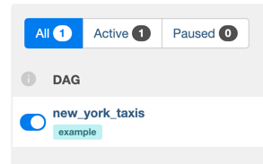
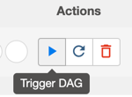

# New York Taxi Pipeline

## Pipeline Usage

### requirements:

```
Docker + Docker-compose
```

### Installation

- Clone repository `git clone https://github.com/robomillo/new_york_taxis.git`
- Navigate to root of directory
- run `docker-compose up`. (if airflow webserver gets stuck in a cycle of restarting, run `docker-compose down -v && docker-compose up` )

### Shortcuts

In order to reduce the size data downloaded and processed for the sake of speed, I have restricted 
the data to a monthly dataset in 2019 only.

### Running Pipeline

- Navigate to [http://localhost:8080](http://localhost:8080)
    - default credentials for airflow:
      user=`airflow` password=`airflow`
- Ensure dag is active



- Click to trigger dag run:



## Helper queries

All the transformational queries can be found
in [./dags/transform_taxi_data/create_datasets.sql](dags/transform_taxi_data/create_datasets.sql)

Question 2.1

```
SELECT * FROM 
datasets.popular_dest_zones_by_total_passengers
WHERE drop_off_location = 'Chinatown' AND pick_up_month = '2019-09' 
AND total_passengers_rank <= 10 
```

Question 2.2

```
SELECT * FROM
    datasets.popular_dest_boroughs_by_ride_count
WHERE pick_up_borough = 'Manhattan' 
  AND pick_up_month = '2019-08' and total_trips_rank <= 10;
  
```

Question 3

```
select * from datasets.historical_rankings;
```

Question 4

```
select * from datasets.current_month_ranked_trips;
```
